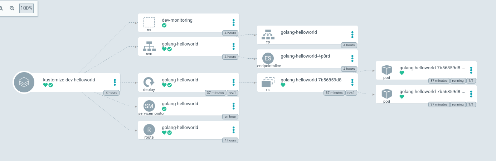
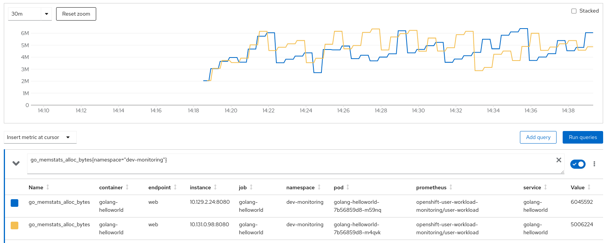
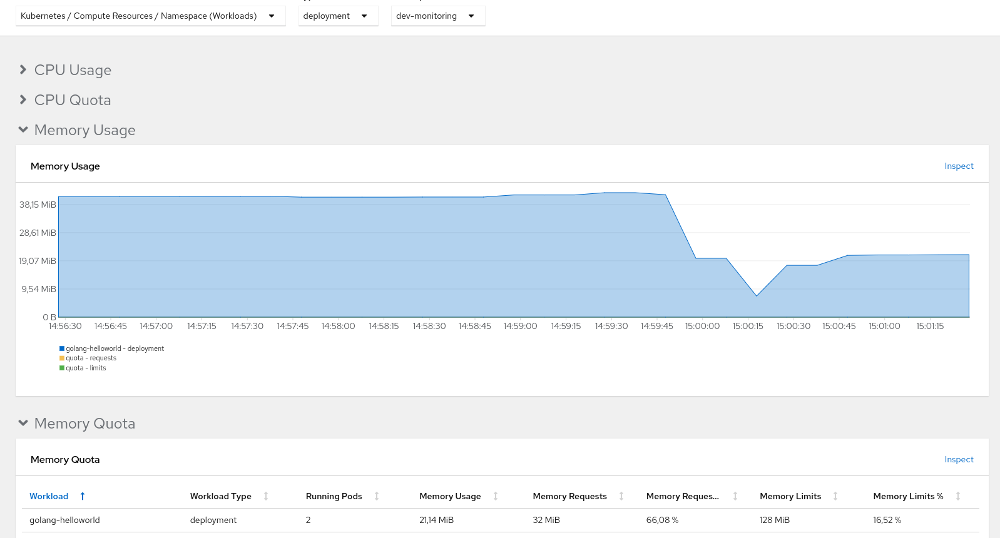

# GitOps

GitOps isn't mandatory to run this example. I use it to facilitate this example and the agility.

If you prefer to avoid it, you can go directly to the following point.

## Install GitOps operator

Install the operator:

```zsh
❯ oc apply -f gitops/gitops-operator.yaml
subscription.operators.coreos.com/openshift-gitops created
```

Get the route:

```zsh
❯ oc get route -n openshift-gitops | grep server | awk '{print $2}'
openshift-gitops-server.{your-domain}.com
```

Go to the route and use your own credentials.

## Configure the application

In the ocp folder, you can find the files needed to deploy the application. 

You only have to apply the ApplicationSet:

```zsh
❯ oc apply -f gitops/golang-applicationset.yaml
applicationset.argoproj.io/kustomize-bootstrap created
```

We need grant GitOps' user roles to create a ```ServiceMonitor```. 

```zsh
❯ oc policy add-role-to-user monitoring-edit system:serviceaccount:openshift-gitops:openshift-gitops-argocd-application-controller -n dev-monitoring
clusterrole.rbac.authorization.k8s.io/monitoring-edit added: "system:serviceaccount:openshift-gitops:openshift-gitops-argocd-application-controller"
```

## Test the application

We are going to test our application. Firstly we will see the state in ArgoCD dashboard:



Once we are sure that the application is running, we will execute an endpoint, for example the ```greetings`` endpoint:

```zsh
❯ SERVICE_ENDPOINT=$(oc get route -n dev-monitoring | grep golang | awk '{print $2}')
❯ curl $SERVICE_ENDPOINT/api/v1/greetings
{"msg":"Hello world"}
```

Finally, we can explore the ```metrics``` endpoint that we will use with Grafana and Prometheus in the next step:

```zsh
❯ curl $SERVICE_ENDPOINT/metrics 
# HELP go_gc_duration_seconds A summary of the pause duration of garbage collection cycles.
# TYPE go_gc_duration_seconds summary
go_gc_duration_seconds{quantile="0"} 0
go_gc_duration_seconds{quantile="0.25"} 0
go_gc_duration_seconds{quantile="0.5"} 0
go_gc_duration_seconds{quantile="0.75"} 0
go_gc_duration_seconds{quantile="1"} 0
go_gc_duration_seconds_sum 0
go_gc_duration_seconds_count 0
```

> NOTE: It's an application's responsibility to expose the ```/metrics``` endpoint, like Prometheus format awaits.

# Metrics

The OpenShift monitoring architecture is the following:


By default, the OpenShift installation process installs and configures all the pieces. We can override or customize most parameters.

The main components that we are going to explore are ```Grafana``` and ```Prometheus```

## Metrics with Prometheus

Prometheus has the responsibility to get the information about the metrics along the pods.

By default, Prometheus calls the ```/metrics``` endpoint, finding for a specific format. Most language programming has the corresponding library to expose these metrics.

At the installation step, we grant privileges to the GitOps user.  The reason was that we need to create an ```ServiceMonitor``` object to indicate to Openshift that this service has to be monitored. The dinition of this object is:

```yaml
apiVersion: monitoring.coreos.com/v1
kind: ServiceMonitor
metadata:
  labels:
    k8s-app: golang-helloworld
  name: golang-helloworld
spec:
  endpoints:
  - interval: 30s
    port: web
    scheme: http
  selector:
    matchLabels:
      app: golang-helloworld
```

OpenShift integrates the full monitoring stack in its console. We will find our application metrics in ```Console > Observe > Metrics```. 

We will test our application metrics system, by asking for the memory usage with the following query:

```JQL
go_memstats_alloc_bytes{namespace="dev-monitoring"}
```

The result:



## Dashboards with Grafana

As query monitoring parameter data one-to-one is not a trivial task, we need one way to visualize our data. 

A dashboard is a group of graphs and queries that show us a piece of important information about our system. 

By default, OpenShift offers a set of them, but you can implement as much as you need. To navigate to the dashboard tab: ```Console > Observe > Dashboards```




# References
- https://docs.openshift.com/container-platform/4.9/monitoring/monitoring-overview.html
- https://github.com/dbgjerez/golang-k8s-helm-helloworld